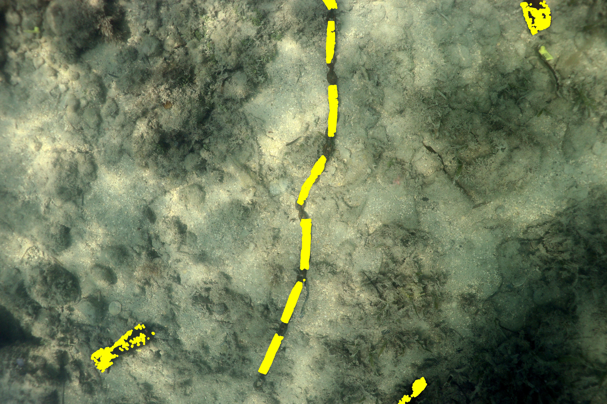
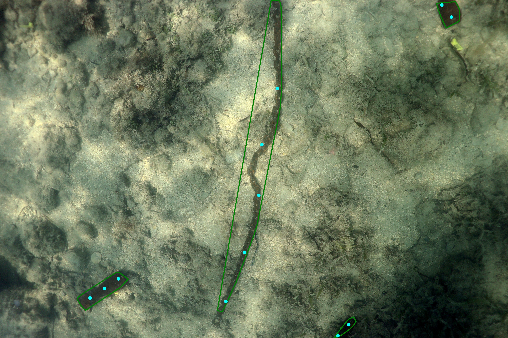
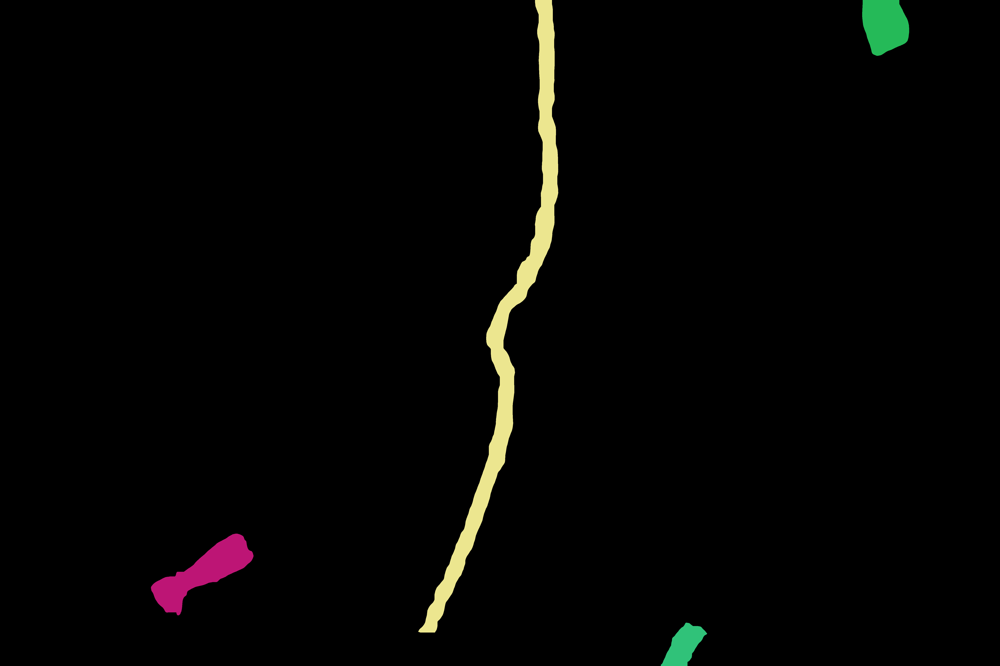

# Prompt_Generator
A pipeline to generate well-distributed prompts on target to do SAM Segmentation

## Requirements

SAM

## Files

- Inference.py: It generates a mask by reading the projected 3d projected points    
- Generator.py: It generates sparse prompts based on the 3D projected points distribution or the polygon of the targets    

## Input

1. Original Images: [W, H, 3]   
2.  CSV files: annotation files [x, y, classid]

## Performance

